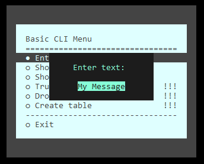

# PHP CLI menu example with SQLite

Simple example of PHP CLI menu with database

## Example uses
- php-school/cli-menu
- PDO SQLITE

## Installing & usage
- `composer install` to install dependencies
- Make sure application has permissions to create DB file
- Execute `php cli.php`

<c> mo
